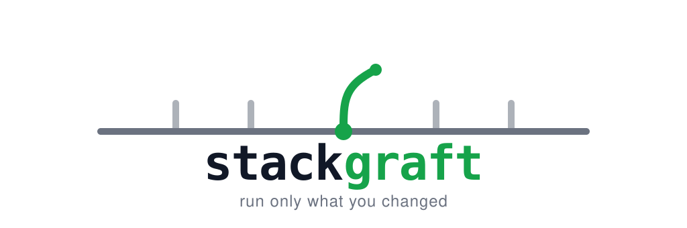

<p align="center">
  
</p>

<p align="center">
  <strong>Run only the services your git worktree changed</strong><br>
  <em>Agent-agnostic. No runtime to install. Refuses before it corrupts.</em>
</p>

<p align="center">
  <a href="docs/INSTALLATION.md">Installation</a> &bull;
  <a href="docs/HOW-IT-WORKS.md">How it works</a> &bull;
  <a href="docs/SHARED-STATE.md">Shared state</a> &bull;
  <a href="SECURITY.md">Security</a> &bull;
  <a href="CONTRIBUTING.md">Contributing</a> &bull;
  <a href="CHANGELOG.md">Changelog</a>
</p>

---

> **graft** `/ɡrɑːft/` — *horticulture*: joining a living shoot to an established rootstock so the two grow as one. The roots keep working. Only the grafted part is new.

You open a git worktree to work on a branch in parallel. To test it you would have to bring the whole stack up a second time — most of it byte-identical to what is already running.

**stackgraft starts only what you changed**, on its own port, and wires every unchanged dependency back to the stack you already have up.

```
  base stack — already running                    your worktree
  ┌───────────────────────────────┐
  │  catalog-api      :8080       │ ◄──────────────┐
  │  search-indexer   :8090       │ ◄────┐         │  only this one changed
  │  postgres         :5432       │      │         │
  │  storefront       :5173       │      │         │
  └───────────────────────────────┘      │  ┌──────┴───────────────┐
                                         └──┤  catalog-api  :18042 │ ← the graft
                                            └──────────────────────┘
```

One service starts. Three are reused. Nothing is duplicated.

**Scope, stated up front.** Local development: one host, one already-running base stack, N worktrees of one repository in parallel. CI, shared hosts, remote hosts and multi-developer stacks are declared non-goals — a boundary, not a preference, and not a list of things that merely have not been tried. If your base stack does not run on the machine you are sitting at, stackgraft is the wrong tool, and you should learn that here rather than from a refusal several minutes in.

## Why this is not just `docker compose up`

Because the naive version of this **silently corrupts your data**.

Reuse the stack and your overlay reaches the same Postgres everyone else is testing against. Run a migration, insert a row, and you have changed the data under your colleague's feet. It does not error. It works, and it poisons.

There is a nastier variant. A service that only *reads* can still break the base stack by **attaching** to something competitive — a Kafka consumer group, a queue subscriber, an advisory lock, a scheduler singleton. It takes work away from a service you never modified, so the symptom appears where you are not looking.

stackgraft classifies every `(service, store)` pair before anything launches and produces one verdict: reuse the store, isolate inside the instance already running, or refuse. **Unknown resolves to refusal.** An empty answer is a claim that needs evidence, never an omission.

→ [How the gate works](docs/SHARED-STATE.md)

## Quick start

**Any agent that reads the [Agent Skills](https://agentskills.io) standard** — Claude Code, Codex, Cursor, Gemini CLI, Copilot, OpenCode, Goose, Amp, Kiro and ~30 more:

```bash
npx skills add kevocodes/stackgraft
```

That is the whole install, and knowing where each agent keeps its skills is now its job rather than yours. One canonical copy lands in `.agents/skills/stackgraft/`; every agent directory it finds gets a **relative symlink** to that one copy, so there is nothing to keep in sync. `skills-lock.json` pins exactly what you installed by sha256 content hash, and `npx skills update` / `npx skills remove` cover the rest of the lifecycle.

Or with **paks**, pointed straight at the skill folder:

```bash
paks install https://github.com/kevocodes/stackgraft/tree/main/skills/stackgraft
```

**Claude Code**, as a plugin that stays updated:

```
/plugin marketplace add kevocodes/stackgraft
/plugin install stackgraft@stackgraft
```

Then just ask, in whatever words you use:

> *run this worktree against the stack that's already up*

→ [Copying it by hand, per-agent paths and troubleshooting](docs/INSTALLATION.md)

## What ships

```
skills/stackgraft/
├── SKILL.md          the body — the only file loaded whole
├── references/       shared-state.md · discovery.md · traps.md · reaping.md
├── assets/           manifest schema + a worked example
└── scripts/          four POSIX sh helpers
```

**No runtime to install.** The helpers need `git`, a POSIX shell and `awk` — nothing else. `python3` is a stub on a stock macOS, so it was disqualified; hashing rides on `git hash-object`, which the skill already depends on.

**Topology is cached, not re-derived.** A per-repository manifest under `XDG_CACHE_HOME`, keyed by the git common dir so every worktree shares one. Each source records the manifest keys it owns, so a drifted file re-derives only its slice. The manifest is a cache, never truth — on conflict the repository wins.

**Discovery prefers your ecosystem's own resolver** over hand-parsing, and degrades to a marked static parse instead of failing when the resolver is unavailable.

## Creating the worktree is a different job

stackgraft does not create worktrees and does not install dependencies. It starts where that work ends.

[`using-git-worktrees`](https://www.skills.sh/obra/superpowers/using-git-worktrees) covers the creating half — where the worktree should live, gitignore safety, installing dependencies for npm, cargo, pip or go, and a baseline test run — and says so itself: it *"does not start services, manage ports, or handle databases."* That is the half stackgraft does. **The two compose**: use it to create the worktree, then stackgraft to run only what you changed in it.

They meet on one question, where a worktree should live, which is why stackgraft carries a hard rule against placing one under `/tmp` or `/var/tmp` — both are reaped.

## Honest limits

- **A copy is verified before it counts as isolated — and against a repository whose stores declare no discriminating exec-form healthcheck, every writing pair still refuses.** A copy that started is not proof: the run issues one command against the base store, against the copy, and against an empty instance of the same image, and the copy counts only where its answer matches the base store's byte for byte *and* the empty instance answers something else. Where the query fails or cannot be derived, the copy is destroyed and the pair refuses; it is never wired to the base store instead. **The measured cost of that, on the repository this was built for, is that zero of its four stores supply a usable candidate** — postgres and timescaledb declare `CMD-SHELL` healthchecks, which are shell source rather than argument vectors; redis declares `redis-cli ping`, which answers `PONG` on an instance holding nothing; minio declares a health endpoint. So against a repository like that one, **this version provisions a copy and then refuses every writing pair until a read command exists in the repository to query it with.** Where nothing defines one, the run offers to write it — three files, shown in full, written only on your approval, into your own script directory and never into a file it did not author, and nothing staged, committed or pushed. What it writes is `inferred` until a run has watched all three succeed, and your approval is fingerprinted over the files as you approved them, so any later edit — the skill's own included — shows them to you again.
- **Determinacy is per `(unit, store)`.** The manifest is `schemaVersion` 3, and the single service-level `writes` array is gone — it was a positive claim that asserted checked-and-none for every *other* store at once, so a pass that could determine one store and not the next had to say nothing about any of them. A record now covers one pair, `migrates` names only the stores an entrypoint is pointed at, and an absent record is undetermined and refuses exactly as before. **There is no migration path: a manifest written at `schemaVersion` 2 is discarded whole and rediscovered, which costs one discovery pass.**
- **A copy is a duplicate of your base stack's data, on your disk.** It is made once per worktree and store and reused on every later launch, refreshed only when you ask; **every run reports how old the copy is** — the age of the copy, which is not a claim about how far the base store has moved, because the run does not compare them. It carries this repository's complete label set, belongs to one worktree, and is named in every run's output with the exact command that removes it. **Nothing reclaims it for you.** `scripts/reap.sh` has no copy target, so a copy whose worktree you deleted is never reported as an orphan and never removed — it sits on your disk until you run the command the launch printed. The flag interlock `references/reaping.md` section 9a specifies for copies is design, not shipped behaviour: `provider-docker.sh destroy` removes a copy with no flags once it has proved the labels and the worktree. The free-space check that precedes it is **a candidate and not a guarantee** — it measures the runtime's data root and the host filesystem behind it, names which one bound the decision, and prints what it cannot see. `SECURITY.md` states the surface; `references/isolation-providers.md` states the mechanism.
- **Reaping ships, and it reports by default.** Every run now says which of this repository's overlays outlived their worktree; stopping one takes an explicit flag, and removing it takes a second flag on top of that. Nothing is stopped, removed or signalled without both an orphan classification and a matching recorded identity.
- **The base stack is outside the candidate set by construction. The port test on top of that is only as good as what the caller passes.** Only an overlay launch writes the ownership label, so a base-stack container is never a candidate to begin with — that half is structural and holds under every flag. The shape that gets past it — a container hand-labelled with this repository's id — is tested against the base-stack ports the run passes in, and **that test is caller-supplied and caller-defeatable**: the helpers parse no JSON, so nothing can check a passed port against the manifest it came from, and a run that passes the wrong one reaps the container. A mutation given no port at all refuses rather than guessing, and no flag stands in for one. A value that is not a port in 1–65535 is a usage error, which removes typos and closes nothing — `1` is a valid port. So the limit is stated rather than covered, here as in `references/reaping.md` and in the requirement itself: a hand-labelled container whose worktree is unlisted and whose published port is not among the values passed **is reaped**. Nothing else on a running container tells a base-stack service apart from an overlay.
- **It sees only overlays launched after the labels shipped**, so the first run legitimately reports nothing to act on. A container started before that carries no ownership label, which means nothing distinguishes it from any other container on the machine — there is no query that finds it, so the report names the category, says the gap is structural, and prints the command to look by hand rather than widening a query into a neighbouring repository. An accepted coverage loss, stated out loud.
- **The verification is real but young.** Schema negatives, script runs and body budgets are checked in CI; the shared-state gate has never been exercised against a production-shaped repository.
- **Needs a POSIX shell.** macOS, Linux, WSL and Git Bash on Windows, each exercised in CI. PowerShell and cmd are out of scope.
- **`git` is required and is not present in minimal container images** — alpine, debian-slim and distroless ship none.

## The name

**stack** + **graft**.

Grafting joins a living shoot to a rootstock that is already established. The roots keep working; only the grafted part is new.

Your running stack is the rootstock. The service you changed is the shoot. The alternate port and the rewired dependencies are the join.

## License

[Apache-2.0](LICENSE)
